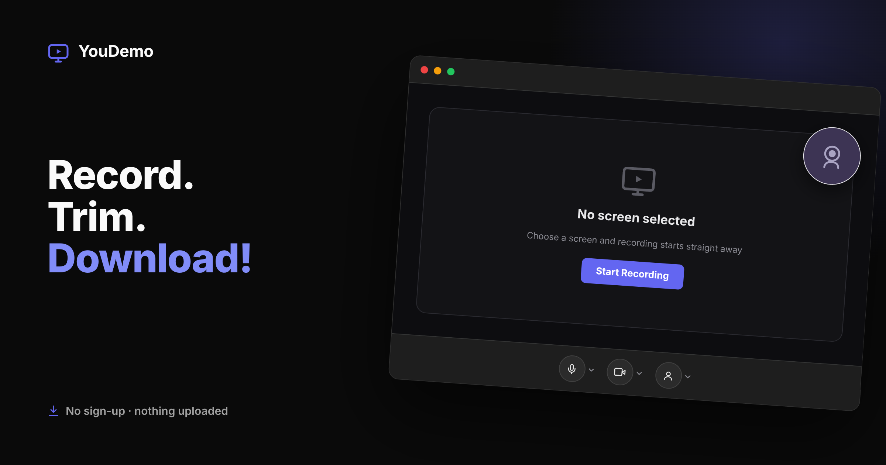

# YouDemo



A browser-only screen and webcam recorder for making quick, personal demo videos
— no installation, no subscription, no backend. Just open it and record.

Try [YouDemo](https://mjakinowittering.github.io/youdemo/) now!

---

## Features

- **Screen capture** — record any tab, window, or screen
- **Webcam overlay** — picture-in-picture webcam bubble, draggable to 8
  positions
- **Background blur** — blur the background behind your webcam in real time
  using on-device AI segmentation; three intensity levels, nothing uploaded
- **Audio mixing** — microphone and system audio captured together
- **Canvas compositing** — screen and webcam combined into a single video stream
  in real time
- **Record in takes** — pause and resume to capture multiple clips; they're
  stitched into one continuous video automatically
- **Frame strip editor** — timeline of thumbnail frames, select and soft-delete
  sections before export
- **WebM export** — combining and trimming are rendered natively in the browser
  (canvas + `MediaRecorder`); output is ready to drop into Slack, Notion, or
  anywhere else
- **Crash recovery** — every take is saved to the browser's private file storage
  (OPFS) as you record, so if the tab crashes or you reload by accident, YouDemo
  reopens straight into the editor with your whole recording intact — nothing
  leaves your machine
- **No backend** — everything runs in the browser; nothing is uploaded anywhere
- **Dark and light mode** — because it matters
- **Deployable to GitHub Pages** — host it yourself for free

---

## Backlog

Things that would make YouDemo even better — contributions welcome.

- **Live Recording Preview** — show the composited video as it happens
- **Undo deleted frames** — restore soft-deleted frames before export
- **Blur loading indicator** — surface progress when the on-device segmentation
  model and WASM runtime are downloading/initialising on first blur toggle, so
  the brief delay before blur appears is clearly communicated
- **Recording resolution cap** — option to cap the recording resolution (e.g.
  1280×720) for smaller file sizes
- **Quick trim** — trim-to-highlight shortcut for the most common editing
  workflow
- **Easter eggs** — there should definitely be easter eggs

---

## The Story

I'm a Product Manager. I build B2B SaaS applications for a living. I also
believe that just because something is business software, it doesn't have to be
joyless — good software can be fun, a little whimsical, and occasionally hide an
easter egg or two.

For years, my personal daily driver laptop was a Google Pixelbook. ChromeOS has
a killer feature for a PM: built-in screen capture with picture-in-picture
webcam and audio. No setup. No subscription. Just record, and share. I used it
constantly — quick demo videos to share exciting new features with colleagues,
personal updates that felt more human than a wall of text and screenshots in
Slack. Quick demo videos and felt personal and human. A real step up from
capturing GIFs with ScreenToGif.

Then my Pixelbook died. 💀 RIP. 🪦 😭

Rather than license new software or buy another machine, I found myself
thinking: _I have a Claude Pro subscription. I can specify software. How hard
could this be?_ There was a learning curve for sure. But much quicker than
expected.

After a quick experiment to confirm the idea was feasible, I started what turned
out to be a proper vibe coding journey — learning how to use a `CLAUDE.md` spec
file as the source of truth, using MCP tools for SvelteKit documentation, and
feeding incremental feedback back into a single Claude.ai session to build
incremental change instructions for Claude Code one round at a time. Debugging
and improving the specification as we went on this MVP journey together. A few
weekends and evenings later, here we are.

The name came from a conversation with my wife. We found it amusing and highly
descriptive. Like the Ronseal adverts: _does exactly what it says on the tin._

**YouDemo.** You. Demo. Simple.

Please get in touch if you'd like to know more.

— [Matthew Akino-Wittering](https://matthew.akinowittering.com/), Product
Manager

---

## Local Development

### Prerequisites

- Node.js 18+
- npm

### Setup

```bash
# Clone the repository
git clone https://github.com/mjakinowittering/youdemo.git
cd youdemo

# Install dependencies
npm install
```

### Commands

```bash
# Start the development server
npm run dev

# Build for production
npm run build

# Preview the production build locally
npm run preview

# Run tests
npm run test

# Lint and format
npm run lint
npm run format
```

### Deployment

The app is built as a fully static site using `@sveltejs/adapter-static` and can
be deployed to GitHub Pages or any static host.

```bash
# Build the static site
npm run build

# The output is in /build — deploy this directory
```

For GitHub Pages, push the contents of `/build` to your `gh-pages` branch, or
configure Pages to serve from `/build` on `main`.

---

## Tech Stack

- [SvelteKit](https://kit.svelte.dev/) + [Svelte 5](https://svelte.dev/)
- [TypeScript](https://www.typescriptlang.org/)
- [Tailwind CSS v4](https://tailwindcss.com/)
- [shadcn-svelte](https://www.shadcn-svelte.com/)
- **Canvas + `MediaRecorder`** — recording, plus combining clips and trimming,
  are all done natively in the browser (no server, no WASM transcoder)
- [MediaPipe Tasks Vision](https://ai.google.dev/edge/mediapipe/solutions/vision/image_segmenter)
  — on-device selfie segmentation for background blur
- [lucide-svelte](https://lucide.dev/) — icons
- Deployed to [GitHub Pages](https://pages.github.com/)
