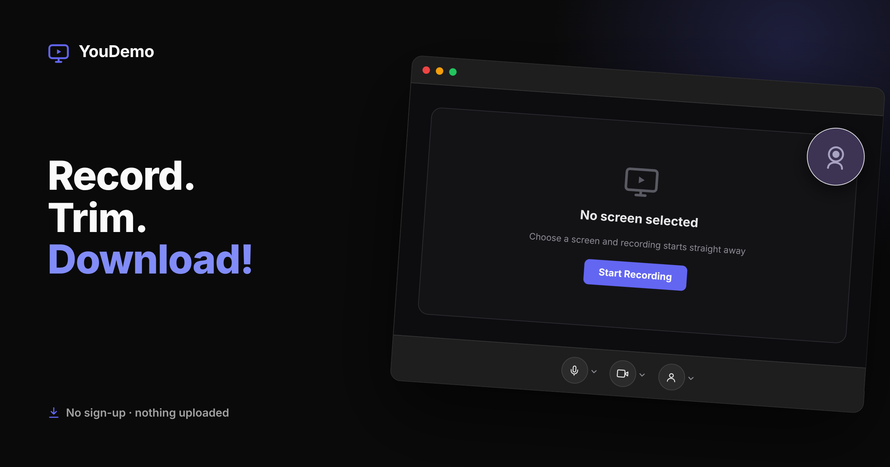

# YouDemo



A browser-only screen and webcam recorder for making quick, personal demo videos
— no installation, no subscription, no backend. Just open it and record.

Try [YouDemo](https://mjakinowittering.github.io/youdemo/) now!

---

## Features

- **Screen capture** — record any tab, window, or screen
- **Webcam overlay** — picture-in-picture webcam bubble, draggable to 8
  positions
- **Background blur** — blur the background behind your webcam in real time
  using on-device AI segmentation; three intensity levels, nothing uploaded
- **Audio mixing** — microphone and system audio captured together
- **Canvas compositing** — screen and webcam combined into a single video stream
  in real time
- **Record in takes** — pause and resume to capture multiple clips; they're
  stitched into one continuous video automatically
- **Frame strip editor** — timeline of thumbnail frames, select and soft-delete
  sections before export
- **WebM export** — combining and trimming are rendered natively in the browser
  (canvas + `MediaRecorder`); output is ready to drop into Slack, Notion, or
  anywhere else
- **Crash recovery** — every take is saved to the browser's private file storage
  (OPFS) as you record, so if the tab crashes or you reload by accident, YouDemo
  reopens straight into the editor with your whole recording intact — nothing
  leaves your machine
- **No backend** — everything runs in the browser; nothing is uploaded anywhere
- **Dark and light mode** — because it matters
- **Deployable to GitHub Pages** — host it yourself for free

---

## Todo

Things that would make YouDemo even better — contributions welcome.

### Bugs

#### Capture

- [ ] **Handle blur failing to load** — if `createBlurProcessor` rejects (WASM
      or model 404, no GPU or CPU delegate), the blur effect in `+page.svelte`
      doesn't catch it: the loading overlay clears and Setup previews the raw
      camera while the blur button still reads on. Then `startRecording`'s
      `await blurReady` rethrows once the countdown ends, and the global
      unhandled-rejection handler swaps in the `ErrorScreen`, so the take never
      starts. Catch it in the effect, turn `blurOn` off and tell the user blur
      isn't available. Because blur is a privacy control, the fix must never
      record an unblurred background while the button says blur is on

#### Editor

- [ ] **Keep cuts on Back to Editor** — Done's "Back to Editor" remounts
      `Editor.svelte`, which owns `deletedRanges`, so every cut is lost and the
      full recording comes back. Lift the cuts into `+page.svelte` (it already
      holds `exportDeletedRanges`) and pass them down. The E2E test "cuts
      shorten the final duration and survive a round trip to Done" is marked
      `test.fail()` until then
- [ ] **Fix `effectiveToRawTime` at a cut boundary** — in `editorMath.ts`, a
      kept time that lands exactly on the start of a deleted span maps to that
      span's start rather than its end (the `remaining <= keptDuration` check),
      so effective time 0 with the opening seconds cut returns 0. Harmless in
      the app today because `resolveSeekTarget` snaps it forward, but the
      function is wrong on its own; add the edge case to
      `tests/editorMath.spec.ts`

#### App shell

- [ ] **Give the welcome dialog an accessible name** — `WelcomeModal.svelte`
      renders its heading as a plain `<h2>`, not `Dialog.Title`, so screen
      readers announce an unnamed dialog. Use `Dialog.Title` (and
      `Dialog.Description` for the intro line)

### Features

#### Capture

- [ ] **Live Recording Preview** — show the composited video as it happens
- [ ] **Recording resolution cap** — option to cap the recording resolution
      (e.g. 1280×720) for smaller file sizes

#### Editor

- [ ] **Undo deleted frames** — restore soft-deleted frames before export
- [ ] **Quick trim** — trim-to-highlight shortcut for the most common editing
      workflow

#### Fun

- [ ] **Easter eggs** — there should definitely be easter eggs

---

## The Story

I'm a Product Manager. I build B2B SaaS applications for a living. I also
believe that just because something is business software, it doesn't have to be
joyless — good software can be fun, a little whimsical, and occasionally hide an
easter egg or two.

For years, my personal daily driver laptop was a Google Pixelbook. ChromeOS has
a killer feature for a PM: built-in screen capture with picture-in-picture
webcam and audio. No setup. No subscription. Just record, and share. I used it
constantly — quick demo videos to share exciting new features with colleagues,
personal updates that felt more human than a wall of text and screenshots in
Slack. Quick demo videos and felt personal and human. A real step up from
capturing GIFs with ScreenToGif.

Then my Pixelbook died. 💀 RIP. 🪦 😭

Rather than license new software or buy another machine, I found myself
thinking: _I have a Claude Pro subscription. I can specify software. How hard
could this be?_ There was a learning curve for sure. But much quicker than
expected.

After a quick experiment to confirm the idea was feasible, I started what turned
out to be a proper vibe coding journey — learning how to use a `CLAUDE.md` spec
file as the source of truth, using MCP tools for SvelteKit documentation, and
feeding incremental feedback back into a single Claude.ai session to build
incremental change instructions for Claude Code one round at a time. Debugging
and improving the specification as we went on this MVP journey together. A few
weekends and evenings later, here we are.

The name came from a conversation with my wife. We found it amusing and highly
descriptive. Like the Ronseal adverts: _does exactly what it says on the tin._

**YouDemo.** You. Demo. Simple.

Please get in touch if you'd like to know more.

— [Matthew Akino-Wittering](https://matthew.akinowittering.com/), Product
Manager

---

## Local Development

### Prerequisites

- Node.js 18+
- npm

### Setup

```bash
# Clone the repository
git clone https://github.com/mjakinowittering/youdemo.git
cd youdemo

# Install dependencies
npm install
```

### Commands

```bash
# Start the development server
npm run dev

# Build for production
npm run build

# Preview the production build locally (run `npm run build` first)
npm run preview

# Run tests
npm run test

# Lint and format
npm run lint
npm run format
```

### Deployment

The app is built as a fully static site using `@sveltejs/adapter-static`.

Every push to `master` deploys to GitHub Pages through
`.github/workflows/build-and-deploy.yml`: it type-checks, tests, builds with
`BASE_PATH` set to the Pages sub-path, and publishes `/build`. It can also be
run by hand from the Actions tab. In the repo's Pages settings, set the source
to **GitHub Actions**.

To host it anywhere else, build it and serve the `/build` directory:

```bash
npm run build
```

Set `BASE_PATH` (e.g. `BASE_PATH=/youdemo`) when the site won't be served from
the domain root.

---

## Tech Stack

- [SvelteKit](https://kit.svelte.dev/) + [Svelte 5](https://svelte.dev/)
- [TypeScript](https://www.typescriptlang.org/)
- [Tailwind CSS v4](https://tailwindcss.com/)
- [shadcn-svelte](https://www.shadcn-svelte.com/)
- **Canvas + `MediaRecorder`** — recording, natively in the browser
- [Mediabunny](https://mediabunny.dev) — combining clips and trimming by copying
  the recorded video, so exports lose no quality and take seconds (no server, no
  WASM transcoder)
- [MediaPipe Tasks Vision](https://ai.google.dev/edge/mediapipe/solutions/vision/image_segmenter)
  — on-device selfie segmentation for background blur
- [@lucide/svelte](https://lucide.dev/) — icons
- Deployed to [GitHub Pages](https://pages.github.com/)
